```{r }
#| echo: false
#| message: false
#| warning: false
#| include: false
#| label: setup
library(ggplot2)
library(tidyr)
library(dplyr)
library(purrr)
library(gridExtra)
library(magrittr)
library(stringr)
library(readr)
library(ragg)
library(scales)
library(ggsci)
library(datasauRus)
theme_set(theme_bw())
```

# Data Types, Formats, and Structures

## First Things First!

Before we start creating graphics...

Know the [**type**]{.emph .cerulean-dk .large} and [**format**]{.emph .green .large} of the data you’re working with.\
<br/>

[**Why?**]{.fragment .large}

::: incremental
- the data contains all of the information you want to convey

- the appropriate chart depends on the data type

- Working with R and ggplot is much easier if the data you use is in the right shape
:::

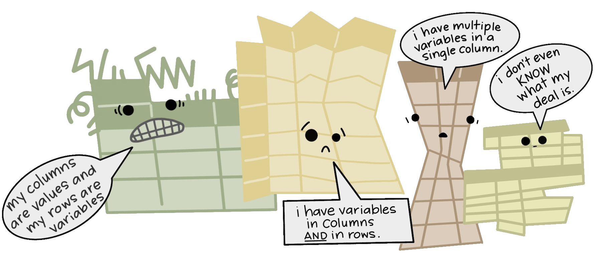{.fragment fig-alt="A group of four tables are all different shapes, look ragged and concerned, and have different speech bubbles reading (from left to right) “my column are values and my rows are variables”, “I have variables in columns AND in rows”, “I have multiple variables in a single column”, and “I don’t even KNOW what my deal is.”" width="50%"}

## Data: levels of measurement

#### Quantitative

- Continuous (e.g. height, weight)
- Discrete (e.g. age in years)

#### Qualitative

- Nominal: categories have no meaningful order (e.g. colors)
- Ordinal: categories have order but no meaningful distance between categories (e.g. five star ratings)

## Data: Dimensions and Type

| Dimensions                 | Types                                 |
|----------------------------|---------------------------------------|
| Univariate (1 variable)    | Count (word freq, scores)             |
| Bivariate (2 variables)    | Time Series, Relationships            |
| Multivariate (3 variables) | Spatial                               |
|                            | Time to Event (Survival, Reliability) |
|                            | Categorical                           |

## Exploring Relationships

::: callout-tip
#### Resources

[Data to Viz](https://www.data-to-viz.com) - figure out what type(s) of chart to use for your data [(use with an ad blocker)]{.emph .green-dk}
:::

::: {layout="[3, 1, 1, 1, 1]"}
Continuous vs. Continuous

{fig-alt="small icon of a scatterplot" width="60px" height="60px"}

{fig-alt="small icon of a line plot" width="60px" height="60px"}

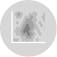{fig-alt="small icon of a 2D density plot" width="60px" height="60px"}

{fig-alt="small icon of an area plot" width="60px" height="60px"}

Continuous vs. Categorical

{fig-alt="small icon of a box plot" width="60px" height="60px"}

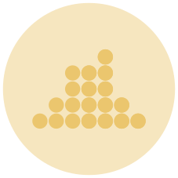{fig-alt="small icon of a dot plot" width="60px" height="60px"}

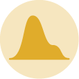{fig-alt="small icon of a density plot" width="60px" height="60px"}

{fig-alt="small icon of a violin plot" width="60px" height="60px"}

Categorical vs. Categorical

{fig-alt="small icon of a mosaic plot" width="60px" height="60px"}

{fig-alt="small icon of a heatmap" width="60px" height="60px"}

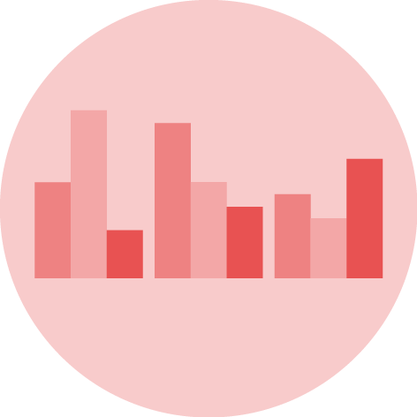{fig-alt="small icon of a grouped bar plot" width="60px" height="60px"}

{fig-alt="small icon of a stacked bar plot" width="60px" height="60px"}
:::

::: {layout="[3, 4]"}
Multidimensional

It depends...
:::

## Tidy Data

{fig-alt="Stylized text providing an overview of Tidy Data. The top reads “Tidy data is a standard way of mapping the meaning of a dataset to its structure. - Hadley Wickham.” On the left reads “In tidy data: each variable forms a column; each observation forms a row; each cell is a single measurement.” There is an example table on the lower right with columns ‘id’, ‘name’ and ‘color’ with observations for different cats, illustrating tidy data structure." width="90%"}

`ggplot2` assumes your data is tidy

## Untidy data

> Happy families are all alike; every unhappy family is unhappy in its own way. - Leo Tolstoy

::: fragment
#### Five main ways tables of data tend not to be tidy
:::

::: incremental
1.  Column headers are values, not variable names.

2.  Multiple variables are stored in one column.

3.  Variables are stored in both rows and columns.

4.  Multiple types of observational units are stored in the same table.

5.  A single observational unit is stored in multiple tables.
:::

::: {.callout-tip .fragment}
AI can be very useful to help you find the right R commands to move from untidy to tidy data.

Other resources: [Reshaping Data](https://srvanderplas.github.io/stat-computing-r-python/part-wrangling/05-data-reshape.html), a chapter in Statistical Computing in R and Python (free website)
:::

# `ggplot2`

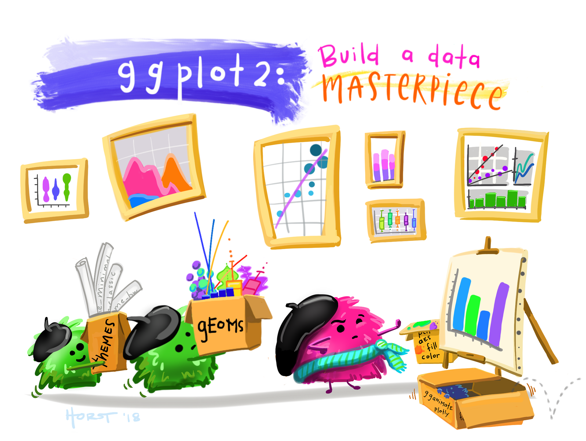{fig-alt="A fuzzy monster in a beret and scarf, critiquing their own column graph on a canvas in front of them while other assistant monsters (also in berets) carry over boxes full of elements that can be used to customize a graph (like themes and geometric shapes). In the background is a wall with framed data visualizations. Stylized text reads “ggplot2: build a data masterpiece.” Learn more about ggplot2." width="70%"}

## ggplot2 basics

`ggplot2` is based on the **grammar of graphics** - every chart is based on the same components:

1.  a data set,
2.  coordinate system,
3.  geoms -- visual marks that represent data points

Values from the data set are **mapped** to properties of the geom using **aesthetics** like size, color, and/or x and y location

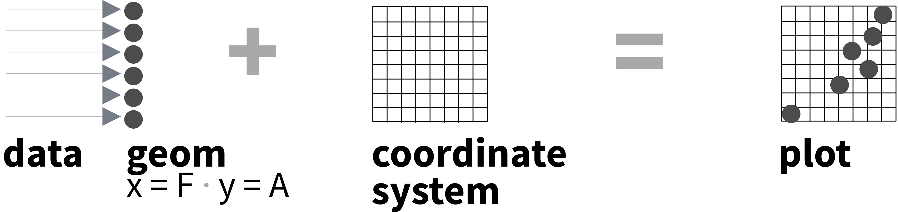{fig-alt="A dataset mapped to geoms, plus a coordinate system, yields a plot. Here, dat is mapped to x and y."}

## ggplot2 basics

`ggplot2` is based on the **grammar of graphics** - every chart is based on the same components:

1.  a data set,
2.  coordinate system,
3.  geoms -- visual marks that represent data points

Values from the data set are **mapped** to properties of the geom using **aesthetics** like size, color, and/or x and y location

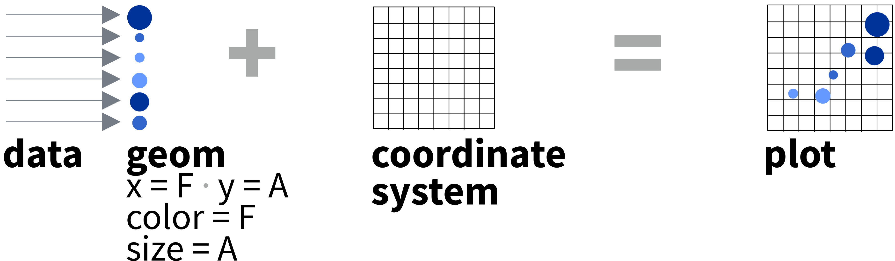{fig-alt="A dataset mapped to geoms, plus a coordinate system, yields a plot. Here, data is mapped to x, y, color, and size."}

## How to build a graph

`ggplot(data = mpg, aes(x = cty, y = hwy))`

- This will begin a plot that you can finish by adding layers to.

- You can add one geom per layer

```{r}
#| label: plots-4
#| fig-height: 3
#| fig-width: 3.3
#| layout-ncol: 3
#| echo: false
#| fig-alt:
#|   - "A blank plot with x-axis labeled class and y-axis labeled hwy"
#|   - "A set of boxplots, one for each class of vehicle, showing the highway mpg of each class."
#|   - "A set of boxplots on top of points showing the actual data for highway mpg for each class of vehicles."
ggplot(data = mpg, aes(x = class, y = hwy)) +
  labs(title = "")
ggplot(data = mpg, aes(x = class, y = hwy)) +
  geom_boxplot() +
  labs(title = "+ geom_boxplot()")
ggplot(data = mpg, aes(x = class, y = hwy)) +
  geom_jitter() +
  geom_boxplot() +
  labs(title = "+ geom_jitter() + geom_boxplot()")
```

```{r}
#| eval: false
#| purl: true
ggplot(data = mpg, aes(x = class, y = hwy)) +
  labs(title = "")
ggplot(data = mpg, aes(x = class, y = hwy)) +
  geom_boxplot() +
  labs(title = "+ geom_boxplot()")
ggplot(data = mpg, aes(x = class, y = hwy)) +
  geom_jitter() +
  geom_boxplot() +
  labs(title = "+ geom_jitter() + geom_boxplot()")
```

## What is a geom?

- A geom function represents data points
- Aesthetic properties represent variables

```{r}
#| echo: false
#| layout-ncol: 2
#| fig-width: 5
#| fig-height: 5
#| out-width: 80%
ggplot(data = mpg, aes(x = cty, y = hwy, colour = class)) +
  geom_text(aes(label = class)) +
  scale_color_locuszoom() +
  labs(x = "city mpg", y = "highway mpg", title = "Geom Text")
ggplot(data = mpg, aes(x = cty, y = hwy, colour = class)) +
  geom_point() +
  scale_color_locuszoom() +
  labs(x = "city mpg", y = "highway mpg", title = "Geom Point")
```

```{r}
#| eval: false
#| purl: true
#|
ggplot(data = mpg, aes(x = cty, y = hwy, colour = class)) +
  geom_text(aes(label = class)) +
  labs(x = "city mpg", y = "highway mpg", title = "Geom Text")

ggplot(data = mpg, aes(x = cty, y = hwy, colour = class)) +
  geom_point() +
  labs(x = "city mpg", y = "highway mpg", title = "Geom Point")
```

<!-- Once our data is formatted and we know what type of variables we are working with, we can select the correct geom for our visualization.  -->

## Geom Options: `geom_xxx`
::::: columns
:::: column

::: {.callout-note icon=false}
#### Primitives
::: {layout-ncol=5}

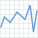{width="75" fig-alt="geom_path"}

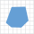{width="75" fig-alt="geom_polygon"}

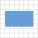{width="75" fig-alt="geom_rect"}

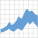{width="75" fig-alt="geom_ribbon"}

{width="75" fig-alt="geom_curve"}

:::
:::

::: {.callout-note icon=false}
#### Two Continuous Variables
::: {layout="[[2,1,1,1],[2, 1, 1, 1],[2, 1, 1, 1]]"}

Functions

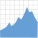{width="75" fig-alt="geom_area"}

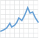{width="75" fig-alt="geom_line"}

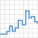{width="75" fig-alt="geom_step"}


Relationships

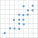{width="75" fig-alt="geom_point"}

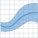{width="75" fig-alt="geom_smooth"}

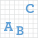{width="75" fig-alt="geom_text"}

Distributions

{width="75" fig-alt="geom_bin2d"}

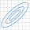{width="75" fig-alt="geom_density_2d"}

{width="75" fig-alt="geom_hex"}

:::
:::
::::

:::: column

::: {.callout-note icon=false}
#### One Variable

::: {layout="[[1,-1, 3],[1,-1, 1,1,1]]"}
Discrete

Continuous

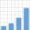{width="75" fig-alt="geom_bar"}

{width="75" fig-alt="geom_dotplot"}

{width="75" fig-alt="geom_histogram"}

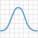{width="75" fig-alt="geom_density"}

:::
:::

::: {.callout-note icon=false}
#### Discrete + Continuous
::: {layout="[[1,1,1,1,1]]"}


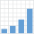{width="75" fig-alt="geom_col"}

{width="75" fig-alt="geom_boxplot"}

{width="75" fig-alt="geom_dotplot"}

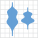{width="75" fig-alt="geom_violin"}

:::
:::

::: {.callout-note icon=false}
#### Two Discrete
::: {layout="[1.5,1,1,-1.5]"}

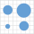{width="75" fig-alt="geom_count"}

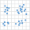{width="75" fig-alt="geom_jitter"}


:::
:::

::::
:::::


## What is a layer?

- Determines the physical representation of the data

- Data + mappings + statistical transformation + geom = a layer

- A plot may have multiple layers
 
```{r}
#| fig-width: 5
#| fig-height: 4
#| layout-ncol: 3
#| echo: false
#| fig-alt:
#|   - "A jittered dotplot of vehicle class (2 seater, compact, midsize, minivan, pickup, subcompact, suv) compared to highway mpg"
#|   - "A violin plot of vehicle class (2 seater, compact, midsize, minivan, pickup, subcompact, suv) compared to highway mpg"
#|   - "A jittered dotplot overlaid with a violin plot, showing  vehicle class (2 seater, compact, midsize, minivan, pickup, subcompact, suv) compared to highway mpg"
ggplot(data = mpg, aes(x = class, y = hwy, colour = class)) +
  geom_jitter(width = 0.1) +
  scale_fill_locuszoom() +
  scale_color_locuszoom() +
  guides(color = "none")
ggplot(data = mpg, aes(x = class, y = hwy, colour = class)) +
  geom_violin(aes(fill = class), alpha = 0.4) +
  scale_fill_locuszoom() +
  scale_color_locuszoom() +
  guides(fill = "none", color = "none")
ggplot(data = mpg, aes(x = class, y = hwy, colour = class)) +
  geom_jitter(width = 0.1) +
  geom_violin(aes(fill = class), alpha = 0.4) +
  scale_fill_locuszoom() +
  scale_color_locuszoom() +
  guides(fill = "none", color = "none")
```

```{r}
#| eval: false
#| purl: true
ggplot(data = mpg, aes(x = class, y = hwy, colour = class)) +
  geom_jitter(width = 0.1)

ggplot(data = mpg, aes(x = class, y = hwy, colour = class)) +
  geom_violin(aes(fill = class), alpha = 0.4)

ggplot(data = mpg, aes(x = class, y = hwy, colour = class)) +
  geom_jitter(width = 0.1) +
  geom_violin(aes(fill = class), alpha = 0.4)
```


## Your Turn {.inverse}

Change the code below to have the points **on top** of the boxplots.

```{r}
#| echo: true
#| fig-height: 4
#| fig-width: 8
#| purl: true
ggplot(data = mpg, aes(x = class, y = hwy)) +
  geom_jitter() +
  geom_boxplot()
```


# Charts on Parade

## Favorite Halloween Candy

[Halloween candy preference data](https://navigatorresearch.org/reeses-is-the-most-preferred-halloween-candy-among-ameri)
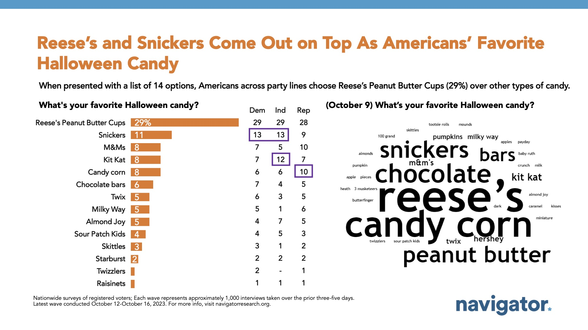{fig-alt="Bar graph of polling data from Navigator Research. Title: Reese’s and Snickers Come Out on Top As Americans’ Favorite Halloween Candy. Also shows a word cloud of favorite candy responses." width="80%"}

- Doesn't add up to 100%, so I've adjusted "Other" category

We'll assume [27% Democrats, 27% Republicans, 46% Independents](https://news.gallup.com/poll/700499/new-high-identify-political-independents.aspx) and not consider political party


## Favorite Halloween Candy

```{r}
library(tibble)
candy <- tribble(~candy, ~dem, ~ind, ~rep, 
                 "Reese's", 29, 29, 28, 
                 "Snickers", 13, 13, 9, 
                 "M&Ms", 7, 5, 10, 
                 "Kit Kat", 7, 12, 7, 
                 "Candy Corn", 6, 6, 10, 
                 "Chocolate bars", 7, 4, 5, 
                 "Twix", 6, 3, 5, 
                 "Milky Way", 5, 1, 6, 
                 "Almond Joy", 4, 7, 5, 
                 "Sour Patch Kids", 4, 5, 3, 
                 "Skittles", 3, 1, 2, 
                 "Starburst", 2, 2, 2, 
                 "Twizzlers", 2, 0, 1, 
                 "Raisinets", 1, 1, 1, 
                 "Other", 4, 11, 6)
candy_types <-  candy$candy
candy_types_min <- c("Reese's", "Snickers", "Kit Kat", "Candy Corn", "M&Ms", "Other")

library(ggplot2)
candy_sum <- candy |>
  # Average over political orientation (weighted by % alignment)
  mutate(overall = .27*dem + .46*ind + .27*rep) |>
  # Sort in descending order by proportion
  arrange(desc(overall)) |>
  # Set bar order and create labels that are single-decimal values with % sign
  mutate(candy = factor(candy, levels = candy_types, ordered = T),
         label = sprintf("%0.1f%%", overall))

candy_short <- candy_sum |>
  # Collapse so that we have only a reasonable number of categories
  mutate(candy = str_replace_all(candy, "Raisinets|Twizzlers|Starburst|Skittles|Sour.Patch.Kids|Milky.Way|Almond.Joy|Chocolate.bars|Twix", "Other")) |>
  group_by(candy) |>
  # Calculate "Other" total proportion
  summarize(overall = sum(overall)) |>
  # Order of categories by size, with other at the end
  mutate(candy = factor(candy, levels = candy_types_min, ordered = T)) |>
  # Arrange the table in descending order
  arrange(desc(candy)) |>
  # Calculate label position as (everything to that point) + 1/2 of label value
  mutate(pos = overall / 2 + lag(cumsum(overall), 1, default = 0),
         label = sprintf("%s %0.1f%%", candy, overall))
```

::: columns
::: {.column width="65%"}
```{r}
#| label: halloween-all
#| echo: true
#| eval: false

ggplot(data = candy_sum, 
       aes(x = candy, y = overall, 
           fill = candy)) +
  geom_col() +
  geom_text(aes(label = label), 
            hjust = -0.1) + 
  coord_flip() + 
  ylab("Percent") + 
  xlab("") + 
  ggtitle("Favorite US Halloween Candy") +
  scale_y_continuous(limits = c(0, 35)) +
  guides(fill = "none") 
```
:::
::: {.column width="35%"}

```{r}
#| label: halloween-all
#| echo: false
#| eval: true
#| fig-width: 4
#| fig-height: 5
#| fig-alt: "A bar chart showing the favorite types of Halloween Candy reported by americans. Reese's (28.7%), Snickers (11.9%), Kit Kat (8.4%), M&Ms (7.3%), Candy Corn (7.1%), Chocolate bars (5.7%), Almond Joy (5.1%), Twix (4.9%), Milky Way (4.2%), Sour Patch Kids (4.0%), Skittles (2.2%), Starburst (2.0%), Twizzlers (1.2%), Raisinets (1.0%), Other (6.4%)"
```


:::
:::

## Favorite Halloween Candy

Define base plot and extra theme bits:

```{r}
#| echo: true

base_plot <- candy_short |>
  ggplot(aes(x = candy, 
             y = overall, 
             label = label,
             fill = candy, 
             color = candy)) 


labels <- list(ylab("Percent"),
               xlab(""),
               ggtitle("Favorite US Halloween Candy"),
               guides(fill = "none", color = "none"))

stack_extras <- list(theme(panel.grid = element_blank(),
                           axis.text.x = element_blank(),
                           axis.title.x = element_blank(),
                           axis.ticks.x = element_blank())) 

polar_extras <- list(theme(axis.text = element_blank(), 
                           axis.title = element_blank(), 
                           axis.ticks = element_blank(), 
                           panel.grid = element_blank()))

```


## Favorite Halloween Candy
```{r}
#| echo: true

base_plot + 
  geom_col() + 
  labels

```

## Favorite Halloween Candy
### Basic Bar Chart

::: columns
::: {.column width="65%"}
```{r}
#| label: halloween-bar
#| echo: true
#| eval: false
base_plot +
  labels + 
  geom_col(aes(x = candy),
           position = "identity" ) + 
  geom_label(aes(x = candy), 
             text.color = "black",
             fill = "white", 
             size = 3)
```
:::
::: {.column width="35%"}

```{r}
#| label: halloween-bar
#| echo: false
#| eval: true
#| fig-width: 4
#| fig-height: 5
#| fig-alt: "A stacked bar chart showing the favorite types of Halloween Candy reported by americans. Other (36.1%), M&Ms (6.9%), Candy Corn (7.1%), Kit Kat (9.3%), Snickers (11.9%), Reese's (28.7%)"
```


:::
:::


## Favorite Halloween Candy
### Position: Stack
::: columns
::: {.column width="65%"}
```{r}
#| label: halloween-stacked-bar
#| echo: true
#| eval: false
base_plot  +
  labels + stack_extras +
  geom_col(aes(x = 0), 
           position = "stack") +
  geom_label(aes(x = 0, y = pos), 
             text.color = "black",
             fill = "white", 
             size = 3)

```
:::
::: {.column width="35%"}

```{r}
#| label: halloween-stacked-bar
#| echo: false
#| eval: true
#| fig-width: 4
#| fig-height: 5
#| fig-alt: "A stacked bar chart showing the favorite types of Halloween Candy reported by americans. Other (36.1%), M&Ms (6.9%), Candy Corn (7.1%), Kit Kat (9.3%), Snickers (11.9%), Reese's (28.7%)"
```


:::
:::

## Favorite Halloween Candy
### Coordinates: Polar

::: columns
::: {.column width="65%"}
```{r}
#| label: halloween-pie
#| echo: true
#| eval: false
base_plot +
  labels + polar_extras + 
  geom_col(aes(x = 0), 
           position = "stack") +
  geom_label(aes(x = 0.65,  y = pos), 
             text.color = "black", 
             fill = "white",
             size = 3) +
  coord_polar(theta = "y", start = pi)

```
:::
::: {.column width="35%"}

```{r}
#| label: halloween-pie
#| echo: false
#| eval: true
#| fig-width: 4
#| fig-height: 5
#| fig-alt: "A pie chart showing the favorite types of Halloween Candy reported by americans. Other (36.1%), M&Ms (6.9%), Candy Corn (7.1%), Kit Kat (9.3%), Snickers (11.9%), Reese's (28.7%)"
```


:::
:::


## Favorite Halloween Candy
### Coordinates: Polar
::: columns
::: {.column width="65%"}
```{r}
#| label: halloween-pie2
#| echo: true
#| eval: false

base_plot + 
  labels + polar_extras + 
  geom_col(aes(x = 2), 
           position = "stack") +
  geom_label(aes(x = 2.75, y = pos), 
             text.color = "black", 
             fill = "white",
             size = 3) + 
  coord_polar(theta = "y", start = pi) +
  scale_x_continuous(limits = c(0, 3))
```
:::
::: {.column width="35%"}

```{r}
#| label: halloween-pie2
#| echo: false
#| eval: true
#| fig-width: 4
#| fig-height: 5
#| fig-alt: "A pie chart showing the favorite types of Halloween Candy reported by americans. Other (36.1%), M&Ms (6.9%), Candy Corn (7.1%), Kit Kat (9.3%), Snickers (11.9%), Reese's (28.7%)"
```


:::
:::

