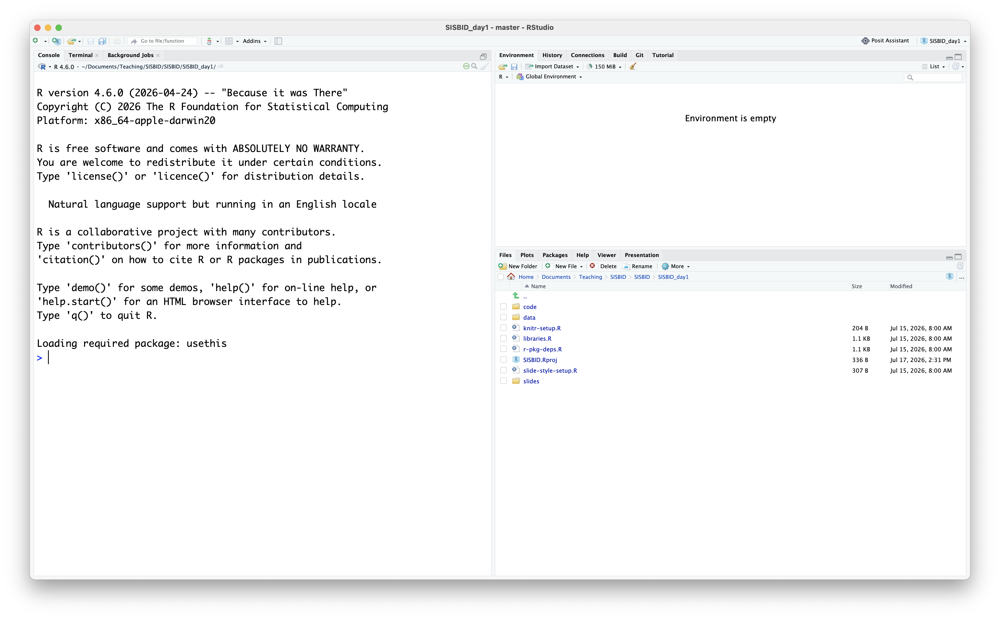

```{r}
#| echo: false
#| message: false
#| warning: false
knitr::opts_chunk$set(
  message = FALSE,
  warning = FALSE,
  error = FALSE, 
  collapse = TRUE,
  comment = "",
  fig.height = 5,
  fig.width = 8,
  fig.align = "center",
  cache = FALSE,
  echo=FALSE
)
```

```{r}
#| echo: false
#| eval: false
#pak::pak("hadley/emo")
#pak::pak("mitchelloharawild/icons")
```

```{r setup}
library(leaflet)
library(readr)
library(tidyverse)
library(htmlwidgets)
library(plotly)
library(ggplot2)
theme_set(theme_bw())
```

## {background-image="images/Hello-Heike.png" background-size="contain" background-image-alt="A 'Hello, my name is' sticker with the name Heike"}

## {background-image="images/Hello-Susan.png" background-size="contain"  background-image-alt="A 'Hello, my name is' sticker with the name Susan"}


## Visual explorations


We like to go on data explorations: [Weather in Blanding](../materials/weather-data.html)

## Your Turn {.inverse .large}

Introduce yourself!

1. Your Name
2. What grade(s) and/or subject(s) you teach
3. What you hope to learn from this workshop
4. What type of data you geek out over


## Your turn: Course materials {.inverse .middle}

<!-- ::: {.smaller} -->
<!-- All materials at <https://github.com/dicook/SISBID> -->

<!-- - __Download__ `SISBID_day1.zip` (a zip archive). This contains all  -->
<!--     - the code files,  -->
<!--     - `qmd` files,  -->
<!--     - and data for day 1 of this workshop.  -->
<!-- - __Unzip the file__ Windows user: use **extract**, don't just double-click -->
<!-- - __Double-click__ `SISBID.Rproj`. The R project helps organise your work over these next few days.  -->
<!-- ::: -->

## What's in the zip?

<!-- -   `.R` file of code, one for each module of the course, use this to follow along -->
<!-- -   `data` folder containing data sets used in the course -->
<!-- -   `SISBID.Rproj` for starting RStudio in your course working directory -->

<!-- `r anicon::nia("Please run, edit and change the code as we go! Experiment, break and fix.", colour="#B78ED2", anitype="hover")` -->

## Check your R setup

<!-- > ["If R were an airplane, RStudio would be the airport"\ -->
<!-- > [Julie Lowndes, Openscapes](http://jules32.github.io/resources/RStudio_intro/)]{.orange} -->

<!-- {width="200%"} -->

## R package locations:

<!-- CRAN -->

<!-- ```{r} -->
<!-- #| eval: false -->
<!-- install.packages("nullabor") -->
<!-- ``` -->

<!-- Bioconductor -->

<!-- ```{r} -->
<!-- #| eval: false -->
<!-- if (!requireNamespace("BiocManager", quietly = TRUE)) -->
<!--     install.packages("BiocManager") -->

<!-- BiocManager::install("bigPint") -->
<!-- ``` -->

<!-- Github -->

<!-- ```{r} -->
<!-- #| eval: false -->
<!-- remotes::install_github("wmurphyrd/fiftystater") -->
<!-- ``` -->

<!-- [Code to install all packages required for the course](../r-pkg-deps.R) is available on course website.  -->


## Resources

- [Global Historical Climatology Network (NOAA)](https://www.ncei.noaa.gov/products/land-based-station/global-historical-climatology-network-daily)
- [Utah Weather](https://utahweather.org/)
- [Utah Weather Almanac](https://utahweather.org/almanac)

-   Reference Sheets
  - [RStudio](https://opensource.posit.co/resources/cheatsheets/rstudio-ide/)
  - [Creating plots with ggplot2](https://opensource.posit.co/resources/cheatsheets/data-visualization/)
  - [Importing Data](https://opensource.posit.co/resources/cheatsheets/data-import/)
  - Wrangling Data: [dplyr](https://opensource.posit.co/resources/cheatsheets/data-transformation/), [tidyr](https://opensource.posit.co/resources/cheatsheets/tidyr/), [stringr](https://opensource.posit.co/resources/cheatsheets/strings/), [lubridate](https://opensource.posit.co/resources/cheatsheets/lubridate/)
- Q/A site: <http://stackoverflow.com>
- Free reference books:
  - [Statistical Computing with R and Python](https://srvanderplas.github.io/stat-computing-r-python/), by Susan Vanderplas (you can easily ignore the Python components and use this as an R reference book)
  - [Big Book of R](https://www.bigbookofr.com) - A Book of (free) R books

::: bottom
[<a rel="license" href="http://creativecommons.org/licenses/by-nc-sa/4.0/"></a> This work is licensed under a <a rel="license" href="http://creativecommons.org/licenses/by-nc-sa/4.0/">Creative Commons Attribution-NonCommercial-ShareAlike 4.0 International License</a>.]{style="display:inline-block;"}
:::
