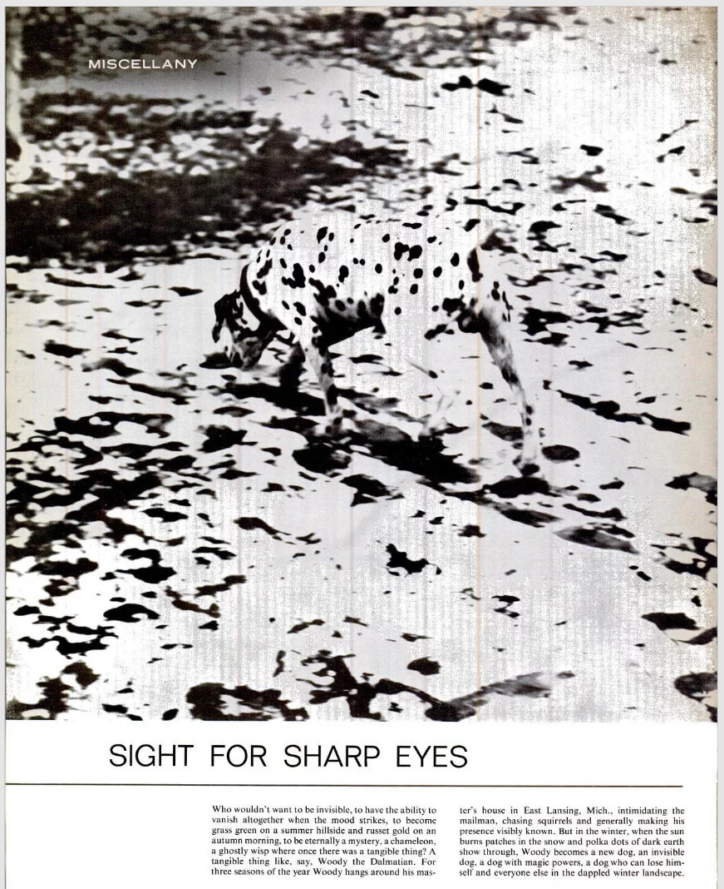
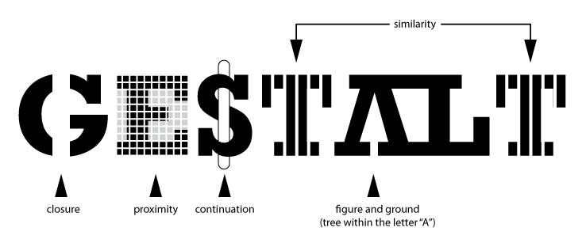
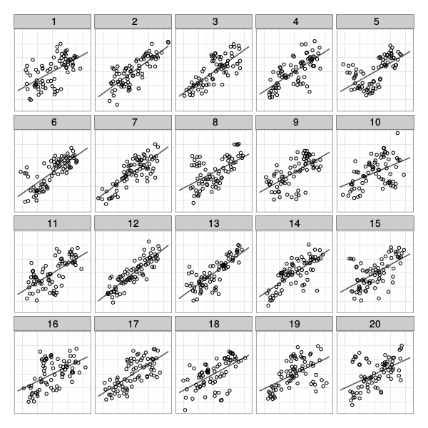
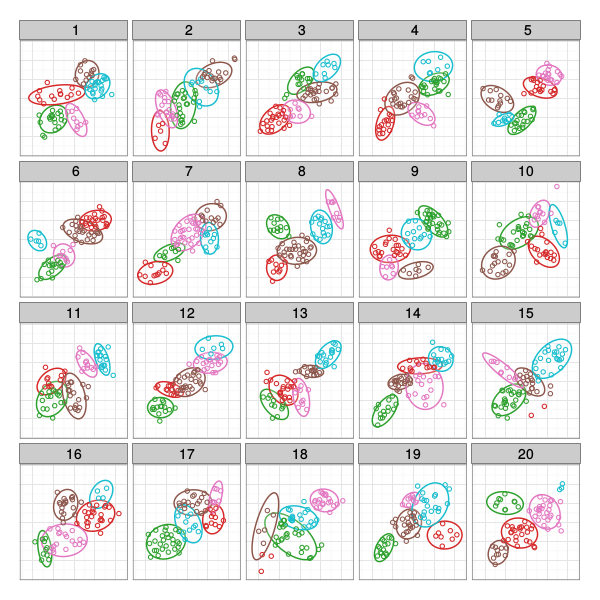
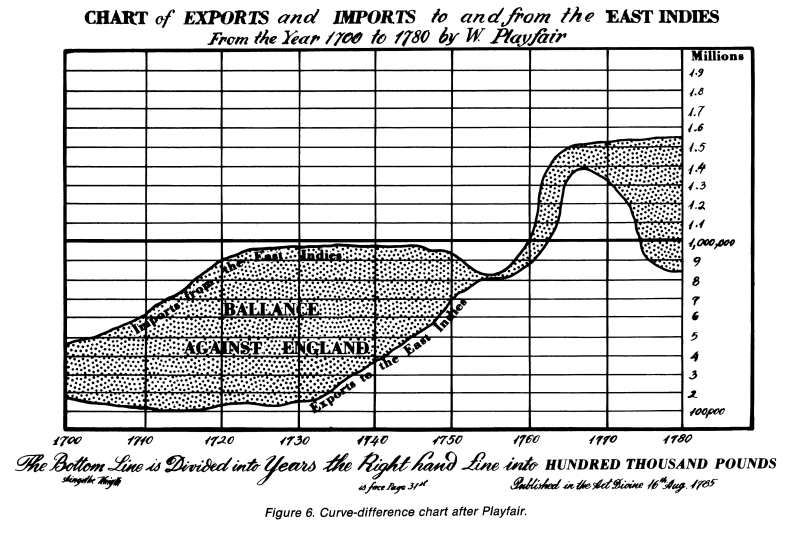
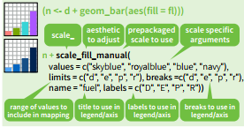
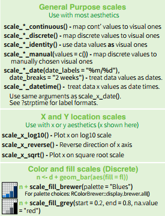
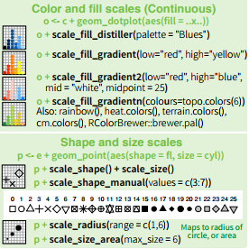

```{r}
#| label: setup
#| include: false
library(tidyverse)
library(ggplot2)
library(dplyr)
library(tidyr)
library(gridExtra)
library(ggsci)
```

```{r}
#| label: knitr-setup
#| include: false
#| purl: false
options(htmltools.dir.version = FALSE)
knitr::opts_chunk$set(
  cache = TRUE,
	echo = FALSE,
	message = FALSE,
	warning = FALSE
)
```

## What do you see?

](https://www.moillusions.com/wp-content/uploads/2009/12/Mysterious-Dalmatian-Optical-Illusion.jpg){fig-alt="A set of black and white. Some of the black blobs roughly form the shape of a dalmation dog."}


## What do you see?

](images/dalmation.png){fig-alt="A set of black, white, and grey blobs. The black blobs roughly form the shape of a dalmation dog."}


## It's not just an illusion - it's a photo

{fig-alt="1965 Life magazine cover showing the dalmation illusion" width="50%"]


## Why Graphics Matter

Graphics are a form of **external cognition** that allow us to think about the **data** rather than the **chart**

::: fragment

Good graphics take advantage of how the brain works
:::

::: incremental

- preattentive processing

- perceptual grouping

- awareness of visual limitations
:::

## Good Graphics

In good graphics, the 

1. graph form
2. data (and structure)
3. aesthetics

all work together to pass information to the brain via the visual system.


::: incremental

The **structure** and **aesthetics** used to create the chart should contribute to the understanding of what is being shown!
:::

## Bad Graphics

<iframe src="https://xkcd.com/1138/#comic" width="800px" height="560px"/>

## Bad Graphics


[{fig-alt="" width = "80%"}](https://en.wikipedia.org/wiki/File:Processor_families_in_TOP500_supercomputers.svg)


## Spot the Difference

```{r}
#| label: preattentive1
#| echo: false
#| include: true
#| fig.width: 4
#| fig.height: 4
#| layout-ncol: 2
set.seed(153253)
data <- data.frame(expand.grid(x=1:6, y=1:6), color=sample(c(1,2), 36, replace=TRUE))
data$x <- data$x+rnorm(36, 0, .5)
data$y <- data$y+rnorm(36, 0, .5)
suppressWarnings(library(ggplot2))
new_theme_empty <- theme_bw()
new_theme_empty$line <- element_blank()
new_theme_empty$strip.text <- element_blank()
new_theme_empty$axis.text <- element_blank()
new_theme_empty$plot.title <- element_blank()
new_theme_empty$axis.title <- element_blank()

data$shape <- c(rep(2, 15), 1, rep(2,20))
library(scales)
ggplot(data=data, aes(x=x, y=y, color=factor(1, levels=c(1,2)), shape=factor(shape)), size=5)+
  geom_point() + 
  scale_shape_manual(guide="none", values=c(19, 15)) +
  scale_color_discrete(guide="none") + new_theme_empty

data$shape <- c(rep(2, 25), 1, rep(2,10))
ggplot(data=data, aes(x=x, y=y, color=factor(shape)), shape=19)+
  geom_point() + 
  scale_shape_manual(guide="none", values=c(19, 15)) + 
  scale_color_discrete(guide="none") + new_theme_empty
```


## Spot the Difference

```{r}
#| label: preattentive2
#| echo: false
#| include: true
#| fig.width: 4
#| fig.height: 4
#| layout-ncol: 2
set.seed(1532532)
data <- data.frame(expand.grid(x=1:6, y=1:6), color=sample(c(1,2), 36, replace=TRUE))
data$x <- data$x+rnorm(36, 0, .5)
data$y <- data$y+rnorm(36, 0, .5)
suppressWarnings(library(ggplot2))
new_theme_empty <- theme_bw()
new_theme_empty$line <- element_blank()
# new_theme_empty$rect <- element_blank()
new_theme_empty$strip.text <- element_blank()
new_theme_empty$axis.text <- element_blank()
new_theme_empty$plot.title <- element_blank()
new_theme_empty$axis.title <- element_blank()
# new_theme_empty$plot.margin <- structure(c(0, 0, -1, -1), unit = "lines", valid.unit = 3L, class = "unit")

data$shape <- data$color
# qplot(data=data, x=x, y=y, color=factor(color), shape=factor(shape), size=I(5))+scale_shape_manual(guide="none", values=c(19, 15)) + scale_color_discrete(guide="none") + new_theme_empty
ggplot(data=data, aes(x=x, y=y, color=factor(color)), shape=factor(shape))+
  geom_point() + 
  scale_shape_manual(guide="none", values=c(19, 15)) +
  scale_color_discrete(guide="none") + new_theme_empty


data$shape[1] <- if(data$shape[1]==2) 1 else 2
# qplot(data=data, x=x, y=y, color=factor(color), shape=factor(shape), size=I(5))+scale_shape_manual(guide="none", values=c(19, 15)) + scale_color_discrete(guide="none") + new_theme_empty
ggplot(data=data, aes(x=x, y=y, color=factor(color)), shape=factor(shape))+
  geom_point() + 
  scale_shape_manual(guide="none", values=c(19, 15)) + 
  scale_color_discrete(guide="none") + new_theme_empty
```


## Preattentive perception 

- Occurs automatically (no effort)

- Color, shape, angle 

- Combinations of preattentive features require attention
    - Unless you double-encode    
    (use different features for the same variable)


::: .increment

Using preattentive features reduces the amount of work your viewer has to expend to understand your chart

:::

## What do you see?


# Gestalt Principles

### What sorts of relationships are inferred, and under what circumstances? 


## Gestalt Laws of Perception




## Gestalt Laws in Data Visualization

```{r}
#| fig-width: 8
#| fig-height: 4
#| out-width: 100%
tmp <- tibble(x = c(-1, 0, 1), y = c(1, -1, 1), group = c(1, 2, 3)) %>%
  mutate(x = purrr::map(x, rnorm, n = 100, sd = .75), 
         y = purrr::map(y, rnorm, n = 100, sd = .75)) %>%
  unnest(x, y) 

library(gridExtra)
grid.arrange(
ggplot(tmp, aes(x = x, y = y, shape = factor(group))) + geom_point() + guides(shape = "none") + theme_minimal() + theme(axis.title = element_blank(), axis.text = element_blank()) + coord_fixed(),
ggplot(tmp, aes(x = x, y = y, color = factor(group))) + geom_point() + guides(color = "none") + theme_minimal() + theme(axis.title = element_blank(), axis.text = element_blank()) + coord_fixed(),
nrow = 1)

```

- Proximity

- Similarity


## Gestalt Laws in Data Visualization

```{r}
#| fig-width: 8
#| fig-height: 4
#| out-width: 100%

tmp <- tibble(g1 = 1, x = seq(-2, 2, .01), y = -sin(pi*x)) %>%
  bind_rows(tibble(x = seq(-2, 2, .01), y = 0, g1 = 2)) %>%
  mutate(color = factor(floor(x)), size = as.numeric(color) %% 2)

ggplot(tmp, aes(x = x, y = y, group = g1)) + geom_line() + scale_size_continuous(range = c(.75, 1.25)) + guides(size = "none", color = "none") + theme_minimal() + theme(axis.title = element_blank(), axis.text = element_blank()) + coord_fixed()
```


## Gestalt Laws in Data Visualization


```{r}
#| fig-width: 8
#| fig-height: 4
#| out-width: 100%
#| 
grid.arrange(
ggplot(tmp, aes(x = x, y = y, group = g1, color = color, size = size)) + geom_line() + scale_size_continuous(range = c(.75, 1.25)) + guides(size = "none", color = "none") + theme_minimal() + theme(axis.title = element_blank(), axis.text = element_blank()) + coord_fixed(),

ggplot(tmp, aes(x = x, y = y, group = g1, color = g1, size = g1)) + geom_line() + scale_size_continuous(range = c(.75, 1.25)) + guides(size = "none", color = "none") + theme_minimal() + theme(axis.title = element_blank(), axis.text = element_blank()) + coord_fixed(),
nrow = 1)
```


- Good continuation


## Which one is different?


{fig-alt="Lineup with trend lines" width = "70%"}


## Which one is different?

{fig-alt="Lineup with color lines" width = "70%"}


## Plot Annotations Matter!

::: columns
::: column


- Plot 12: 59.1% 
- Plot 5:  9.1% 
- Other plots: 31.7% 

:::
::: column

]

- Plot 12: 9.7%
- Plot 5: 29.0% 
- Plot 18: 32.3% 
- Other plots: 29.0% 

:::
:::

# Visual Limitations


## Visual Limitations

- Not all graphical representations are equally accurate

- Optical illusions 

- Designing plots for disabilities

- Color choices

## Accuracy of Graphical Judgements

1. Position along a common scale (most accurate)
    - scatter plot
2. Position along nonaligned scale
    - multiple scatter plots
3. Length
    - bar chart
4. Angle, Slope
    - pie chart
5. Area
    - bubble chart
6. Volume, Density, Color saturation
    - heatmap
7. Color hue (least accurate)


::: notes

When you design a visualization, try to make the most important variables represented by dimensions that are accurate.

In some cases, we only care about relative accuracy - for those, things like color saturation are fine for encoding information. 

You may have heard people talk about how awful pie charts are - that's because anything that can be put into a pie chart can also be put into a bar chart, which will be read more accurately. 

:::

## Optical Illusions




## Designing for Accessibility

- Low visual acuity:
    - High contrast (bright/dark)
    - large font size
    - textures/patterns can be hard to make out

- Colorblindness:
    - Safest: design for a black-and-white photocopier
    - Avoid rainbow gradients
    - If you need a 2-color gradient, use blue/purple - white - orange (safe for most types of colorblindness)
    
- R packages for accessibility
    - ajrgodfrey/BrailleR - translate plots into text descriptions for screen readers
    - sonify - represent data using sound
    - gt - tables with metadata that is easy for screen readers


## Color

- **Hue**: shade of color (red, orange, yellow...)

- **Intensity**: amount of color

- Both color and hue are pre-attentive. Bigger contrast corresponds to faster detection.

- Use color to your advantage

- When choosing color schemes, we will want mappings from data to color that are not just numerically but also ***perceptually*** uniform

- Distinguish between sequential scales and categorical scales


## Color

Color is context-sensitive: A and B are the same intensity and hue, but appear to be different.


## Ordering Variables

Which is bigger?

- Position: higher is bigger (y), items to the right are bigger (x)
- Size, Area
- Color: not always ordered. More contrast = bigger.
- Shape: Unordered. 

```{r}
#| echo: false
#| fig-width: 20
library(RColorBrewer)
library(gridExtra)

data <- data.frame(x = c(1, 2, 3, 4, 5), 
                   y = c(1, 4, 9, 10, 12), 
                   size = c(1, 4, 2, 1, 5))

p1 <- qplot(x, y, data = data, size = size, geom = "point") + 
    scale_size_continuous(range = c(2.5, 5), guide = "none") + 
    theme_bw()  + 
    theme(axis.text = element_blank())

data <- data.frame(x = factor(c(1, 2, 3, 4, 5)), 
                   y = c(4, 3, 1, 5, 2))

p2 <- ggplot(data = data, aes(x = x, weight = y)) + 
    geom_bar() + 
    theme_bw() + 
    theme(axis.text = element_blank())

data <- data.frame(expand.grid(x = 1:6, y = 1:2), 
                   color = c(brewer.pal(7, "Blues")[2:7], 
                             brewer.pal(6, "Set1")))

p3 <- ggplot(data = data, aes(x = x, y = factor(y), color = color)) + 
    geom_point(size = 5) + 
    scale_color_identity() + 
    ylab("") + 
    xlab("") + 
    theme_bw() + 
    theme(axis.text = element_blank())

grid.arrange(p1, p2, p3, nrow = 1)
```


# Aesthetics in `ggplot2`: Scales


## Aesthetics in `ggplot2`

**Aesthetics**: features such as color, shape, and size that map other characteristics to structural features

**Scales** map data values to the visual values of an aesthetic  

 - to change a mapping, add a new scale



## Scales

::: {layout-ncol=2}





:::

## Gradients

Qualitative schemes: no more than 7 colors


```{r}
#| echo: false
#| fig-width: 7
#| fig-height: 1.2
#| purl: false
data <- data.frame(x = 1:7, 
                   blues = brewer.pal(7, "Blues"), 
                   set1 = brewer.pal(7, "Set1"), 
                   diverge = brewer.pal(7,"RdBu"))

ggplot(aes(xmin = x-.5, xmax = x+.5, ymin = 0, ymax = 1, fill = set1), data = data) +
  geom_rect() + 
  scale_fill_identity() + 
  ylab("") + 
  xlab("") + 
  theme(axis.text = element_blank(), 
        axis.ticks = element_blank(), 
        rect = element_blank()) + 
  coord_fixed(ratio = 1) + 
  theme_void()
```

[Can use `colorRampPalette()` from the RColorBrewer package to produce larger palettes by interpolating existing ones]{.small}


```{r}
#| echo: false
#| fig-width: 10
#| fig-height: 1.2
#| purl: false


getPalette = colorRampPalette(brewer.pal(9, "Set1"))

data2 <- data.frame(x = 1:20, 
                   expanded = getPalette(20))

ggplot(aes(xmin = x-.5, xmax = x+.5, ymin = 0, ymax = 1, fill = expanded), data = data2) +
  geom_rect() + 
    scale_fill_identity() + 
    ylab("") + 
    xlab("") + 
    theme(axis.text = element_blank(), 
          axis.ticks = element_blank(), 
          rect = element_blank()) + 
    coord_fixed(ratio = 1) + 
    theme_void()
``` 

Quantitative schemes: use color gradient with only one hue for positive values

```{r}
#| echo: false
#| fig-width: 7
#| fig-height: 1.2
#| purl: false

ggplot(aes(xmin = x-.5, xmax = x+.5, ymin = 0, ymax = 1, fill = blues), data = data) +
  geom_rect() + 
  scale_fill_identity() + 
  ylab("") + 
  xlab("") + 
  theme(axis.text = element_blank(), 
        axis.ticks = element_blank(), 
        rect = element_blank()) + 
  coord_fixed(ratio = 1) + 
  theme_void()

```

## More Gradients

Quantitative schemes: use color gradient with two hues for positive and negative values. Gradient should go through a light, neutral color (white)

```{r} 
#| echo: false
#| fig-width: 7
#| fig-height: 1.5
#| purl: false


ggplot(aes(xmin = x-.5, xmax = x+.5, ymin = 0, ymax = 1, fill = diverge), data = data) +
  geom_rect() + 
  scale_fill_identity() + 
  ylab("") + 
  xlab("") + 
  theme(axis.text = element_blank(), 
        axis.ticks = element_blank(), 
        rect = element_blank()) + 
  coord_fixed(ratio = 1) + 
  theme_void()
``` 

Small objects or thin lines need more contrast than larger areas

## Factors vs. Continuous variables

- Factor variable:
    - `scale_colour_discrete`
    - `scale_colour_brewer(palette = ...)`
- Continuous variable:
    - `scale_colour_gradient` (define low, high values)
    - `scale_colour_gradient2` (define low, mid, and high values)
    - Equivalents for fill: `scale_fill_...`

```{r}
#| fig-height: 4
#| fig-width: 10
#| purl: false
#| layout-ncol: 2
ggplot(data = mpg, aes(x = cty, y = hwy, colour = class)) + geom_point() + scale_color_locuszoom() +labs(x = "city mpg", y = "highway mpg", title = "Factor variable")
ggplot(data = mpg, aes(x = cty, y = hwy, colour = hwy)) + geom_point() + labs(x = "city mpg", y = "highway mpg", title = "Continuous variable")
``` 


## Color in ggplot2

- There are packages available (`ggsci`, `viridis`, `wesanderson`, `RColorBrewer`) that have color schemes for any occasion.

```{r}
#| label: color-ggplot2
#| fig.width: 3
#| fig.height: 3
#| layout-ncol: 4
library(ggsci)
library(viridis)
library(wesanderson)
library(RColorBrewer)


p1 <- ggplot(data = mpg, aes(x = class, fill = class)) + geom_bar() +
  theme_bw() +theme(legend.position = "none", axis.text.x = element_blank())
  
p1 + labs(title= "ggplot2 default")
p1 + scale_fill_npg() + labs(title = "NPG")
p1 + scale_fill_startrek() + labs(title = "Star Trek")
p1 + scale_fill_ucscgb() + labs(title = "UCSCGB")
p1 + scale_fill_viridis(discrete = TRUE) + labs(title = "Viridis")
p1 + scale_fill_viridis(option="magma", discrete = TRUE) + labs(title = "Magma")
p1 + scale_fill_brewer(palette="Set2") + labs(title = "Set2")
p1 + scale_fill_brewer(palette="Dark2") + labs(title = "Dark2")
```
  
  

## Your Turn 

```{r, echo = T, purl = T}
data(diamonds)
```

- In the diamonds data, clarity and cut are ordinal, while price and carat are continuous

- Find a graphic that gives an overview of these four variables while respecting their types

## Additional Resources

- Maps in ggplot2
  - [ggplot2 book chapter](https://ggplot2-book.org/maps.html)
  - [Mapping with ggplot2 (Workshop)](https://kelseyandersen.github.io/DataVizR/mapping.html)
  - [r-spatial ggplot2 maps tutorial](https://r-spatial.org/r/2018/10/25/ggplot2-sf.html)

- General references
  - [R graphics Cookbook](https://r-graphics.org/)
  - [Data Visualization Catalogue](https://datavizcatalogue.com/)

