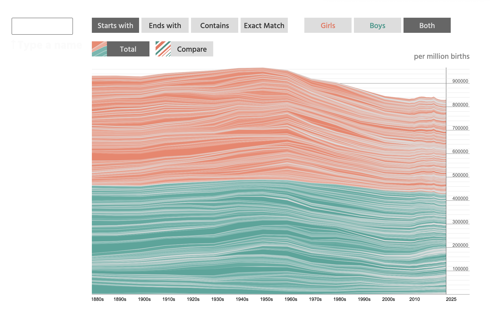

## Take measure of your surroundings

- Personal and personally collected data is more fun/engaging to analyse

- 

## NameGrapher

Laura and Martin Wattenberg's approach to name their firstborn 

https://namerology.com/baby-name-grapher/


## Your Turn

- Did you first check your own name?

- How many names start with a vowel?

- Lautner or Swift? Which Taylor has more influence on baby names?

- What about Orange and Pink as kids' names?

## Praerie Dog Town

From a college-level course on Spatial Ecology: use GPS coordinates from a morning of measuring out a praerie dog town

```{r}
library(tidyverse)

pd_town <- read_csv(here::here("data/praeriedogtown.csv"))

if (!require(leaflet)) {
  install.packages("leaflet")
}
library(leaflet)

pd_town |>
  leaflet() |>
  addProviderTiles(providers$Esri.WorldImagery, group = "World Imagery (satellite)") |>
  addCircles(
    ~ longitude,
    ~ latitude,
    stroke = FALSE,
    group = "inactive",
    fillColor = "brown4",
    fillOpacity = .5,
    radius = 2.5,
    data = pd_town |> filter(active == "n")
  ) |>
  addCircles(
    ~ longitude,
    ~ latitude,
    stroke = FALSE,
    group = "active",
    fillColor = "yellow",
    fillOpacity = .5,
    radius = 2.5,
    data = pd_town |> filter(active == "y")
  )

```

## Your Turn

What data could you collect and visualize with your class?

Reading logs? Habits?

The letter project: how long does it take to get the letter?

e.g. [Henry Kristin's project](https://kristinhenry.github.io/StickersAndStamps/)


## Relationship between Distance travelled and Time 

From Kristin Henry's [blog](https://www.patreon.com/KristinHenry/posts/stickers-and-new-45230596): 

::: {layout-ncol=2}


:::

Which of these two charts do you like better for showing the relationship between *distance travelled* and *days to reach destination*?

What chart would you suggest to use?

## An approximate re-creation of the data

Using Claude AI: "recreate the data from the chart"

::: {layout-ncol=2}


```{r}
claude <- read_csv(here::here("data/estimated_dataset.csv"))
library(ggpcp)
claude |> pcp_select(distance_traveled, days_until_destination) |> pcp_scale() |> ggplot(aes_pcp()) + geom_pcp() + theme_pcp()
```

:::

AIs can't 'see' for us, even when they just try to regenerate data (Clause was trying to resist because of the large number of overplotted lines)

What patterns did Claude miss?

## Re-creation attempt 2

Using Claude AI: "recreate the data from the chart; days are integer; there are only three observations with more than 14 days of time to destination"

::: {layout-ncol=2}


```{r}
claude2 <- read_csv(here::here("data/estimated_dataset_2.csv"))
claude2 |> pcp_select(distance_traveled, days_until_destination) |> pcp_scale() |> ggplot(aes_pcp()) + geom_pcp() + theme_pcp()
```

:::

What about now?

::: incremental
- Marginal distributions are not faithful: gaps along either of the axis is not preserved. 

- 2d clusters seem washed out
:::


## A different attempt

Based on a (larger) dataset published by Kristin Henry

```{r}
# large dataset
#"https://raw.githubusercontent.com/KristinHenry/KristinHenry.github.io/refs/heads/master/ArtsAndChartsTalk/StickerData051622.csv"
stickerdata <- read_csv("https://raw.githubusercontent.com/KristinHenry/KristinHenry.github.io/refs/heads/master/ArtsAndChartsTalk/StickerData122920.csv")


stickerdata_cleaner <- stickerdata |> 
  mutate(date_sent = lubridate::mdy(`Date Mailed`),
         date_arrived = lubridate::mdy(`Date reported recieved`),
         days_travelled = as.numeric(difftime(date_arrived, date_sent))) |>
  filter(days_travelled > 0) 

stickerdata_cleaner |>
  pcp_select(`Distance From SF`,days_travelled) |>
  pcp_scale() |>
  ggplot(aes_pcp()) + geom_pcp() + theme_pcp()
```

## With Colour

```{r}

my_breaks <- c(0, 1, 2, 5, 10, 20, 50, 100)

stickerdata_cleaner |>
  pcp_select(`Distance From SF`,days_travelled) |>
  pcp_scale() |>
  ggplot(aes_pcp()) + geom_pcp(aes(colour = days_travelled)) + theme_pcp() + 
  scale_colour_viridis_c(breaks = my_breaks, labels = my_breaks, 
                       trans = scales::pseudo_log_trans(sigma = 0.001))

```

## And now a Scatterplot

```{r}
stickerdata_cleaner |> ggplot(aes(x = `Distance From SF`, y = days_travelled, colour = days_travelled)) + geom_point(size = 2) + 
  scale_colour_viridis_c(breaks = my_breaks, labels = my_breaks, 
                       trans = scales::pseudo_log_trans(sigma = 0.001)) + scale_y_log10()
```

What do you see?

::: fragment
Three clusters
:::

::: fragment
Only for very large distances there is a positive relationship with the number of days to destination
:::

::: fragment
There might be a hint of a positive association between the two variables in the first cluster (distances to 1250 miles)
:::