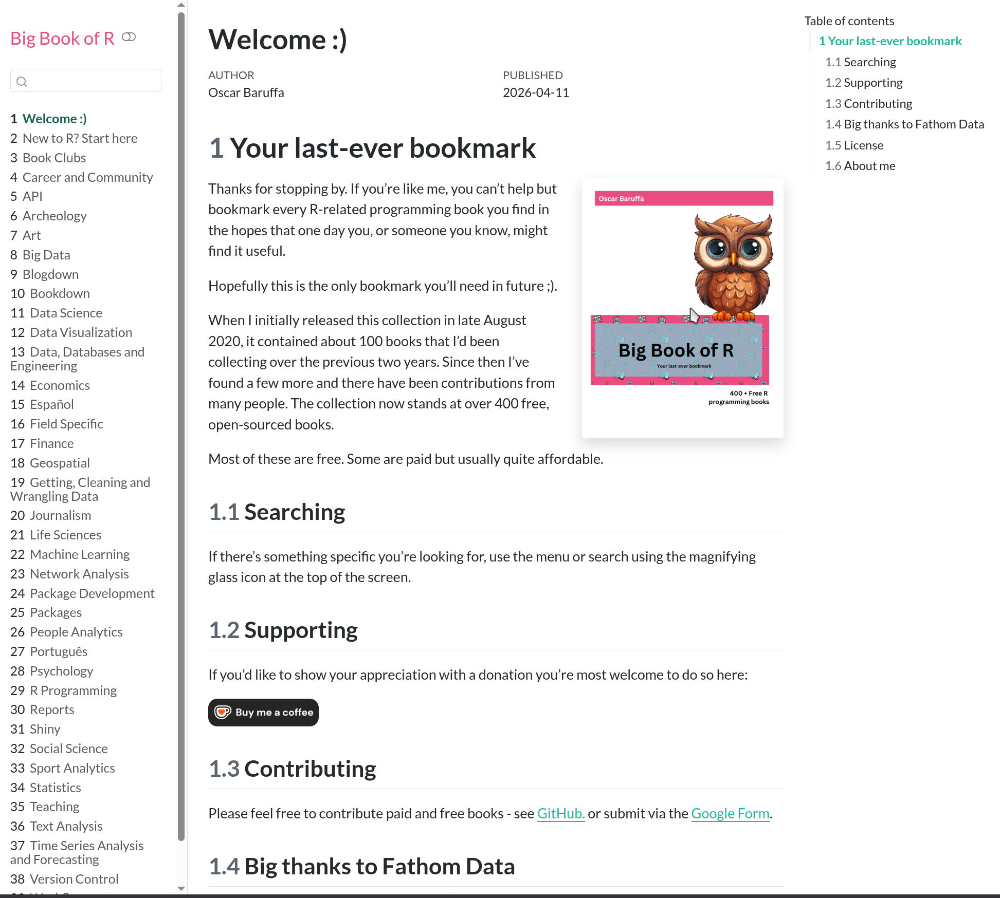
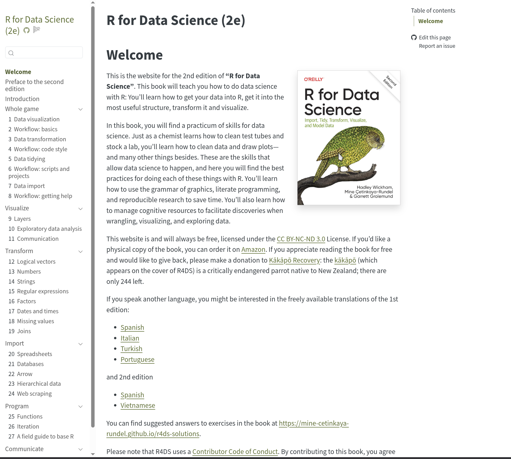

## The Big Book of R

[{fig-alt="A screenshot of the front page of www.bigbookofr.com"})](https://www.bigbookofr.com)

## R for Data Science

[{fig-alt="A screenshot of the front page of https://r4ds.hadley.nz"})](https://r4ds.hadley.nz)

## Teaching R with `decoder`

Kelly Bodwin created a [series of puzzles](https://github.com/kbodwin/decoder) to reinforce different introductory R concepts. 

- [Indexing, matrix/vector creation, introductory debugging](https://github.com/kbodwin/decodeR/tree/master/Base_R)

- [Writing functions and ciphers](https://github.com/kbodwin/decodeR/blob/master/general/general-Puzzle.Rmd)

- [Data Cleaning with `dplyr`](https://github.com/kbodwin/decodeR/blob/master/dplyr/dplyr-Instructions.Rmd)

- [Solving Crimes with `lubridate`](https://github.com/kbodwin/decodeR/blob/master/lubridate/lubridate-Puzzle.Rmd)

- [Regression Diagnostics and Looney Tunes](https://github.com/kbodwin/decodeR/blob/master/regression/regression.Rmd)

- [Joins with `tidyr` and Military Spending](https://github.com/kbodwin/decodeR/blob/master/tidyr/tidyr-Puzzle.qmd)

## Materials I've made

- [Statistical Computing in R and Python](https://srvanderplas.github.io/stat-computing-r-python/) - textbook for UNL (and soon USU?) statistical computing courses

- [Stat-assignments](https://github.com/orgs/stat-assignments/repositories?q=visibility%3Apublic+archived%3Afalse) collection of assignments for data science and statistics classes

- Worksheets for Intro Statistics    
(some of these will need updated links)

  - [Confidence Intervals & The Great Emu War](https://github.com/srvanderplas/unl-stat218-materials/blob/master/handouts/03_Confidence-Intervals.Rmd)
  
  - [Difference of Proportions & Pandemics](https://github.com/srvanderplas/unl-stat218-materials/blob/master/handouts/05_Difference_Proportions.Rmd)
  
  - [Difference of Means: Vampires & Wizards](https://github.com/srvanderplas/unl-stat218-materials/blob/master/handouts/06_Difference_Means.Rmd) 